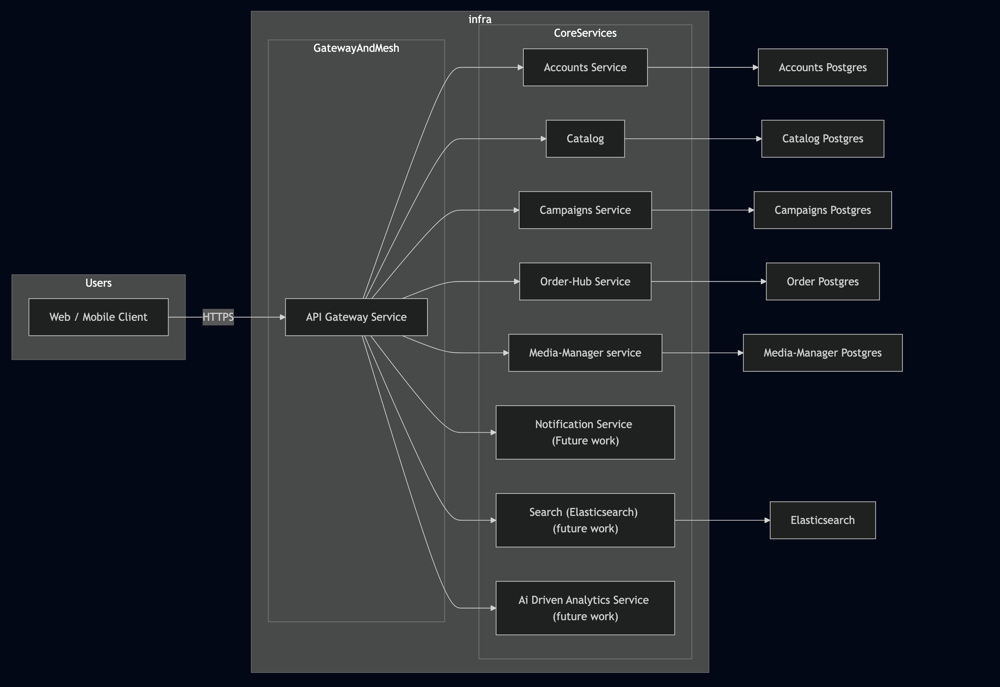

## e-Mall Organization README

# e-Mall Platform

**e-Mall** is a modular, microservices-based e-commerce platform designed to scale, evolve, and support modern online retail workflows. The system is built around independently deployable services, unified through an API Gateway and deployed using Docker Compose.

---

## 🌐 Public Endpoints

- **Front-end**  
    [https://e-mall.store](https://e-mall.store/)
    
- **Back-end API Gateway**  
    [https://api.e-mall.store](https://api.e-mall.store/)
    
- **Deployment Dashboard**  
    [https://deployment.e-mall.store](https://deployment.e-mall.store/)
    
- **Deployment Logs**  
    [https://deployment.e-mall.store/logs/app](https://deployment.e-mall.store/logs/app)
    

---

## 🧩 System Architecture

The platform follows a **microservices architecture**, where each domain is isolated into its own service with a dedicated database.  
All internal services communicate over private Docker networks, while external traffic is routed through an **NGINX Gateway**.

```
Client → NGINX Gateway → Internal Services → Databases
```



---     


## 📦 Core Services

### 1. Catalog Service (Port 8081)

**Endpoint:**  
[https://api.e-mall.store/catalog](https://api.e-mall.store/catalog)

**Responsibilities:**

- Product catalog management
    
- Categories & attributes
    
- Favorites / wishlists
    


---

### 2. Campaigns Service (Port 8082)

**Endpoint:**  
[https://api.e-mall.store/campaigns](https://api.e-mall.store/campaigns)

**Responsibilities:**

- Campaigns & promotions
    
- Discounts & offers
    
- Advertisements and pricing rules
    

---

### 3. Accounts Service (Port 8083)

**Endpoint:**  
[https://api.e-mall.store/accounts](https://api.e-mall.store/accounts)

**Responsibilities:**

- User accounts
    
- Authentication & authorization
    
- Profiles and roles
    
- Mall & Stores details 
    
- Mall & Stores details 
    

---

### 4. Order Hub Service (Port 8084)

**Endpoint:**  
[https://api.e-mall.store/order-hub](https://api.e-mall.store/order-hub)

**Responsibilities:**

- Shopping cart
    
- Orders & returns
    
- Financial operations
    
- Reviews
    

---

### 5. Media Manager Service (Port 8085)

**Endpoint:**  
[https://api.e-mall.store/media-manager](https://api.e-mall.store/media-manager)

**Responsibilities:**

- Media upload & storage
    
- Product images & assets
    

---

### 6. Analysis Service (Port 8086) _(Planned)_

**Responsibilities:**

- Analytics
    
- AI-powered insights and reporting
    

---

### 7. Notification Service (Port 8087) _(Planned)_

**Responsibilities:**

- Email & SMS notifications
    
- System alerts
    

---


## 🚪 API Gateway

The **Gateway** is powered by **NGINX** and acts as the single public entry point to the system.

**Responsibilities:**

- Route requests to internal services
    
- Hide internal service topology
    
- Centralize access logs
    

The gateway only exposes HTTP ports, while all backend services remain on internal Docker networks.

---

## 🗄️ Databases

Each service owns its own **PostgreSQL** database:

- `catalog-db`
    
- `campaigns-db`
    
- `accounts-db`
    
- `order-hub-db`
    
- `media-manager-db`
    

This ensures:

- Strong service isolation
    
- Independent scaling
    
- Safer schema evolution
    

---

## 🐳 Deployment

The platform is deployed using **Docker Compose**:

- Each service runs in its own container
    
- Health checks ensure correct startup order
    
- Internal networks isolate service traffic
    
- Volumes persist database and log data
    

Optional edge tooling:

- **GoAccess** for real-time gateway traffic analytics
    

---

## 🔐 Environment Configuration

Services rely on environment variables for:

- Database credentials
    
- Service discovery (internal hostnames & ports)
    
- JPA schema management (`DDL_AUTO`)
    

Defaults are provided for development, with overrides supported for production.

---

## 🚀 Future Roadmap

- AI-driven analytics and recommendations
    
- Centralized notification system
    
- Observability (metrics & tracing)
    
- Kubernetes-ready deployment
    

---

## 📄 License

This project is part of the **e-Mall Organization** and is intended for internal development and controlled deployment.

---
